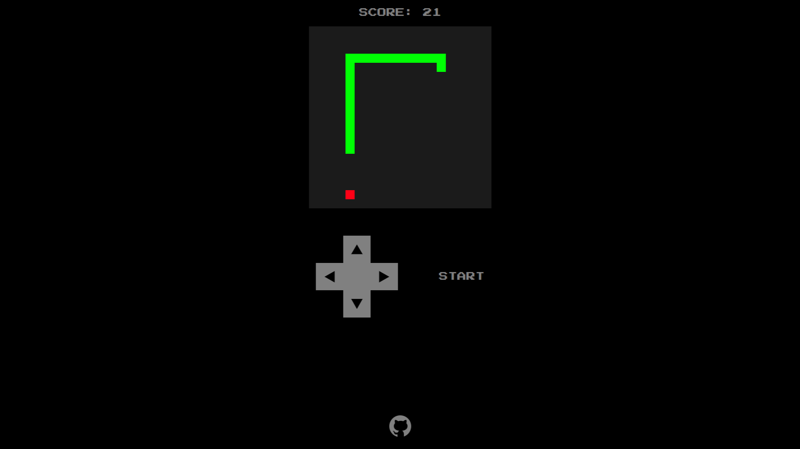

# Classic Snake

## Description

Welcome to Classic Snake! This game is an implementation of Snake using HTML, CSS, and JavaScript. Control the snake to eat food, grow longer, and avoid colliding with the walls or itself.

## Table of Contents

[Features](#features)

[How to Play](#instructions)

[Installation](#installation)

[Link](#link-to-site)

[Screenshot](#screenshot)

[Acknowledgments](#acknowledgments)

## Features

- Classic Snake Gameplay: Navigate the snake to eat food and grow longer.

- Responsive Controls: Use keyboard arrow keys for desktop and virtual arrow buttons for mobile viewports.

- Score Tracking: Keep track of your score as you play.

- Game Over Display: Game over display occurs when the snake collides with the wall or itself.

- Responsive Design: Works well on both desktop and mobile devices.

## Instructions

1. Start the Game: Click the "Start" button to begin.

2. Control the Snake:

    - Desktop: Use the arrow keys on your keyboard.

    - Mobile: Use the directional pad.

3. Objective: Guide the snake to the food. Each time the snake eats the food, it grows longer, and your score increases.

4. Game Over: The game ends if the snake collides with the walls or itself. A "Game Over" message will be displayed.

## Installation

1. Clone this repository.

2. Navigate to the project directory.

3. Open the 'index.html' file in your web browser to start playing.

## Link to site

[Classic Snake](https://joseph-s-foster.github.io/Classic-Snake/)

## Screenshot

## Acknowledgments

Special thanks to Grimoire for guidance and support.

